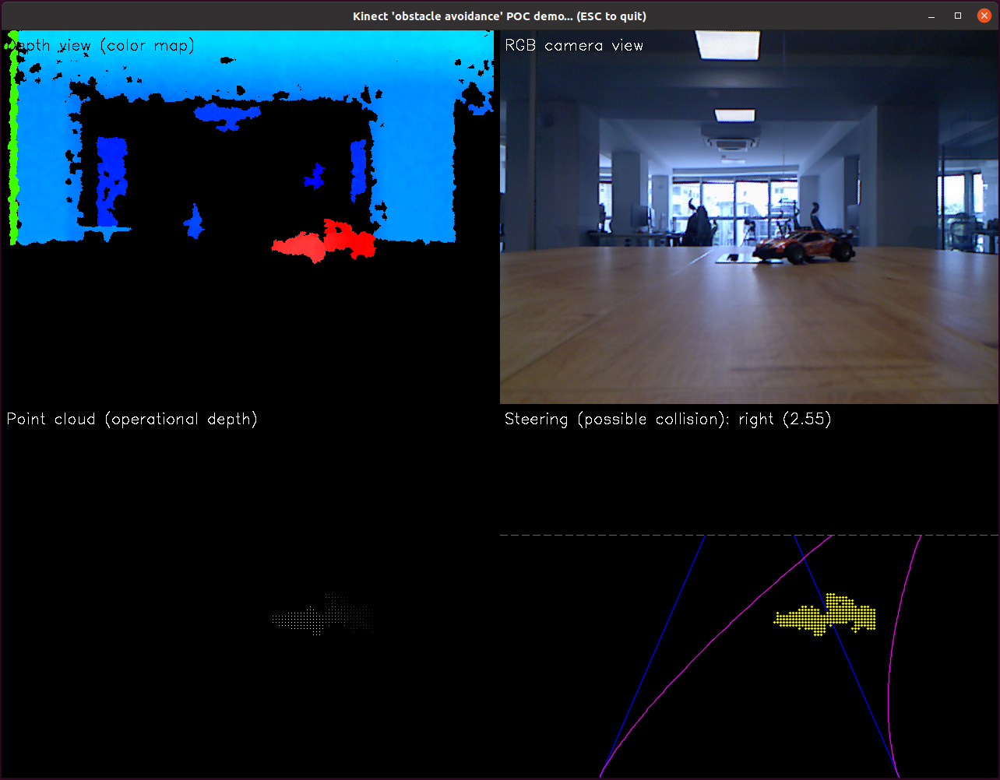
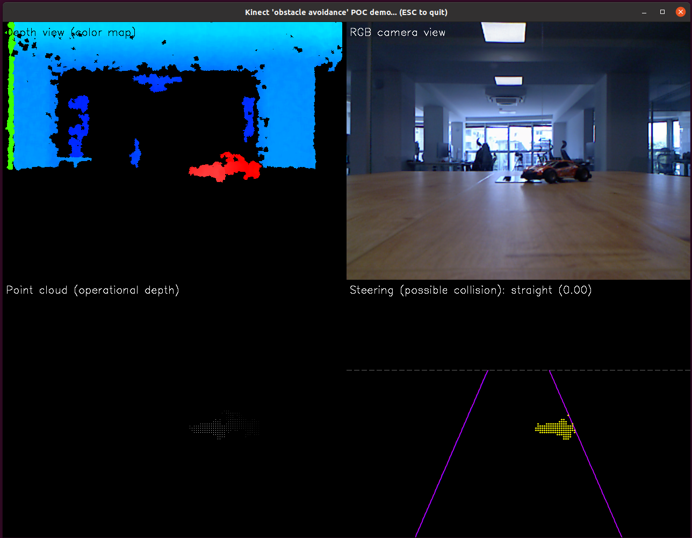
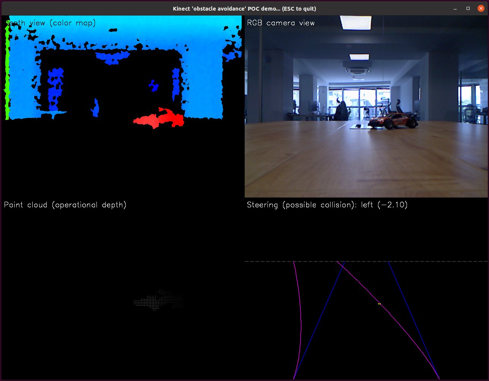
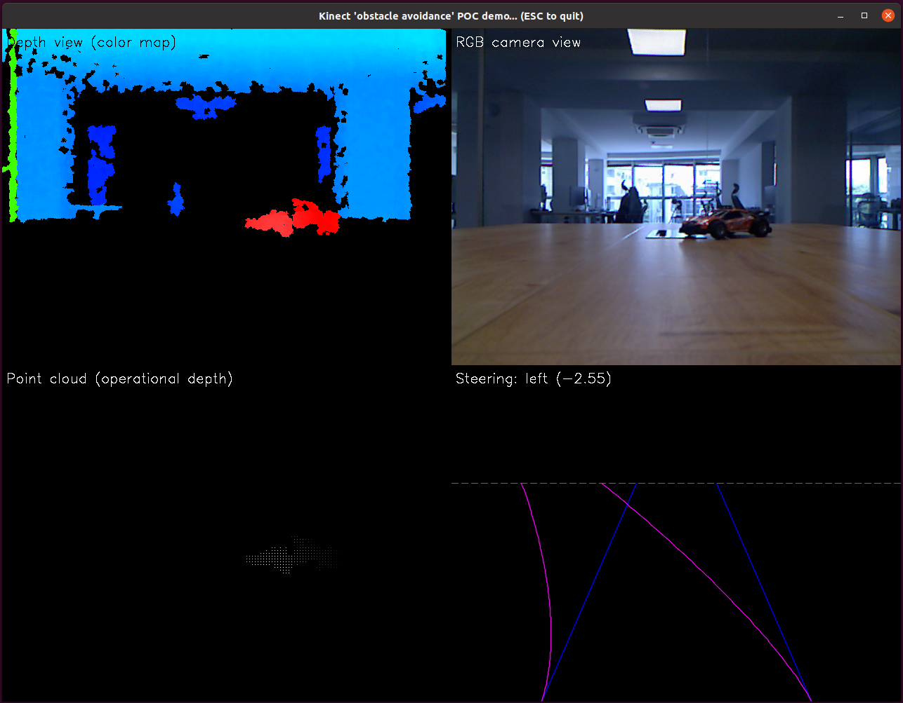

[Home](README.md)

# Detecting obstacles within the driving path of a vehicle when manoeuvering

First you need to clone the repo to your device:

```bash
git clone https://github.com/djeps/kinect_obstacle_avoidance.git
```

Then you `cd` into it:

```bash
cd kinect_obstacle_avoidance
```

... activate your virtual environment (have a look at the [Python prerequisites and environment](PYTHONENV.md)
section should you need more context) and then launch the demo:

```bash
python kinect.py
```

Once it launches, you will notice the screen split up in four different sections or *views*:

- An RGB
- A color depth
- A point cloud, and
- A *steering* view



In a normal application I suppose - should this ever be deployed - you would most likely see the *steering
view* (steering lanes only!) superimposed over the *RGB view*. The reason why I choose to separate and display
all four views, was so that I can demonstrate what's typically happening *behind the scenes*: 1-the *RGB view*
is more or less what the camera and human eyes experience; 2-the *color depth view* is how the sensor perceives
*point dept* where the cooler the color is - the more distant the point is and the warmer the color is - the
closer the point is; 3-the *point cloud view* shows those points which are inside the selected operational
range (approx. 0.4m-1.5m) and finally, 4-the steering view shows the possible steering physics i.e. the steering
path of an imaginary vehicle.

> Note: Use the keyboard keys Left, Right and Up (or 'a', 'd' and 's') to steer the vehicle left or right - or
to straighten it up.

So how do we detect an obstacle is in the way?

Once you start steering in the opposite direction, you will notice the yellow 'point cloud' starts diminishing:




If there's at least one point from the operational point cloud inside or on the verge of the potential steering
path of the vehicle, a possible collision is detected:



Finally, when the system doesn't pick up any point inside the steering path, it is considered safe to steer in
that direction:



What the system is doing, is filtering out those points from the entire point cloud which are inside the operational
range. From the filtered point cloud, for each point in that collection, it picks the corresponding pixel which
represents the point and checks it's X and Y coordinates if they are within the constraints of the steering
path (represented by the lines in magenta color). For each pixel that it finds within those constraints, it
calculates the distance of the corresponding point in the filtered point cloud from the origin of the Kinect
which is a point in space with coordinates (0, 0, 0) - but in the XY plane only - or if we calculate the
real Euclidean distance taking into an account all 3 dimensions, that would correspond I guess to the projection
of the real distance on the XY plane (or the *ground plane* as we have previously referred to it). Should this
distance be any lower than the selected threshold of approx. 60cm (the distance to the sensor), we mark the
corresponding point or rather its pixel representation in yellow color and thus the steering with a potential
obstacle collision.

### Recorded demo

For a recorded video demo of the entire process, feel free to view the following 
[MP4 screen recording](./assets/screenrecords/screenrecord_01.mp4).

> Note: I would like to be fully transparent... Throughout this project, I have used 
[Perplexity AI](https://www.perplexity.ai/library) as *a search engine on steroids*. But I got very intrigued how
well it will cope with generating code when the problem it needs to model in code is completely or somewhat
unknown. Therefore, 90% of the steering simulation is done by Perplexity and the Claude 4.0 Sonnet model!
It took me/us roughly 8 working hours spread across 3 days to come up with something acceptable and useable.
In those 3 days, I carefully explained the physics behind the steering. Sure, I corrected some assumptions
made, tested and fixed code and reiterated the steps, but in all honesty, the AI agent came up with the solution.

[Home](README.md)
