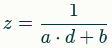
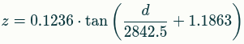

[Home](README.md)

# Basic operational principle of the Kinect

The Kinect v1 was a sensor developed and deployed by Microsoft for its Xbox game console,
released and launched for the first time back in 2010. Its intended use was to enrich the
gaming experience by recognizing (and acting upon) voice commands, gestures and body poses
but being an affordable device it soon found its way in the hobbyist community and in the
DIY automation scene.

The way it works (at least when it comes to its scene processing capabilities) is that it
uses a known pattern (also referred to as *speckles*) that it shoots in the form of near-IR
(*near infra-red*) light onto the scene and objects in front of it and using the embedded
CMOS sensor captures the reflected pattern. It then analyses the distortion of the sensed
pattern and comparing it to the projected pattern, it calculates and estimates the depth.

The RGB sensor is independent of the IR/CMOS sensor and is used to add color information
to the scene.

When we query depth data from the Kinect, it returns a NumPy array of size 480x640 (that's
*height* x *width*) of values between 0 and 2047. This is because the *depth image* of the
Kinect is in 11-bit precision and 2047 is the maximum raw depth reading, representing a
point that's furthest from the Kinect. Consequently, points which are closest to the Kinect
or in its *blind zone* are represented with 0.

> Note: The typical operational range of the Kinect v1 is 0.8m-4.0m. Anything outside that
range is considered unreliable. In typical applications, this range is even more conservative
i.e. approx. 1.2m-3.5m.

To convert from raw depth value to one in meters, we use the following generalized formula:



... where:

- `z` is the depth in meters
- `d` is the raw depth
- `a` and `b` are hardware- and firmware-specific calibration constants of the Kinect v1

If we expand on the calibration constants, we get the following formula:



However, this is impractical for implementing it in programming applications. Therefore,
projects like [the former OpenKinect project](http://www.openkinect.org/) use the *inverse
linear approximation* for, which in Python is:

```python
depth_m = 1.0 / (raw_depth * -0.0030711016 + 3.3309495161)
```

... were:

- `raw_depth` is a sensor reading between `0` and `2047` for a specific point 
- `depth_m` is the converted depth in meters

Similarly, we can derive the physical X and Y coordinates for any point in 3D space:

```python
FOCAL_LENGTH_X = 594.21
FOCAL_LENGTH_Y = 591.04
OPTICAL_CENTER_X = 339.5
OPTICAL_CENTER_Y = 242.7
    
phys_x = (x - OPTICAL_CENTER_X) * depth_m / FOCAL_LENGTH_X
phys_y = (y - OPTICAL_CENTER_Y) * depth_m / FOCAL_LENGTH_Y
```

... where the 2 *focal* and 2 *optical* constants are hardware- and firmware-specific geometric
calibration constants for the Kinect v1.

[Home](README.md)
